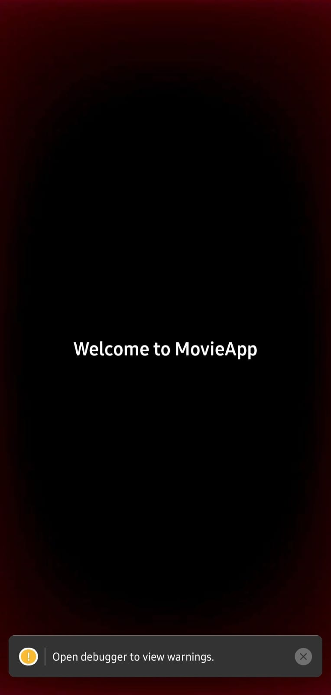
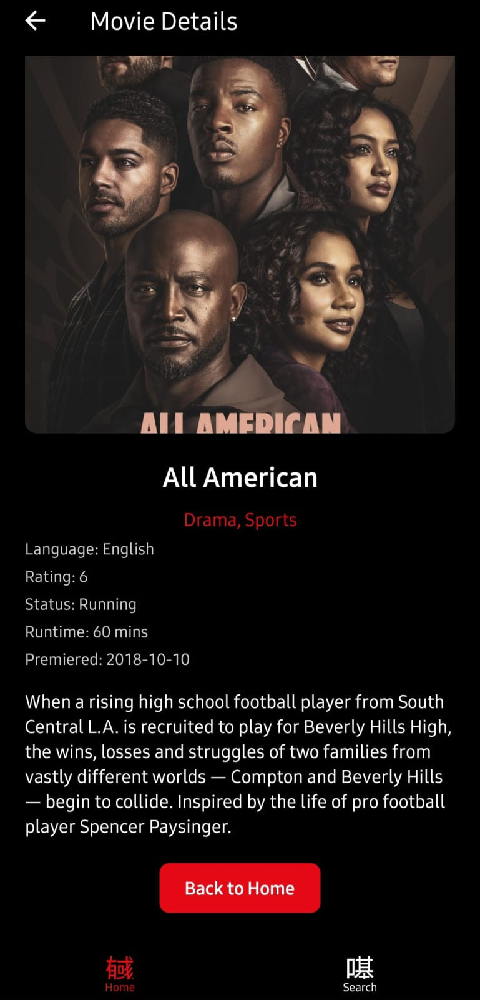
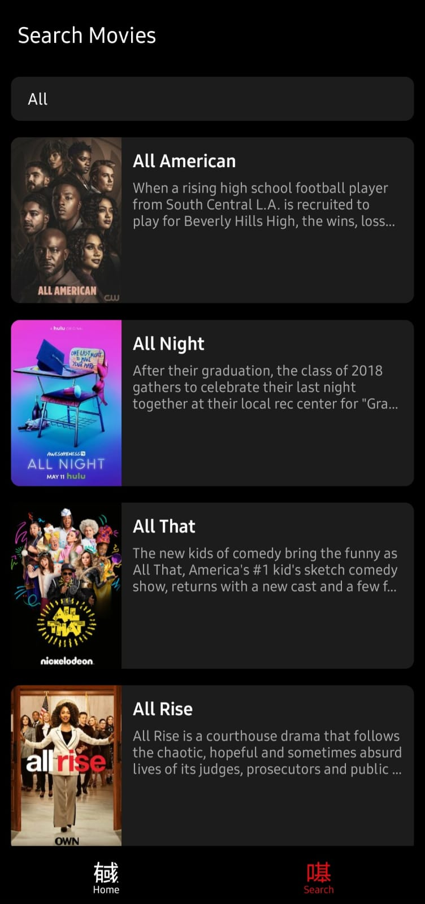

# Netflix Clone

## 📱 About the Project
This is a **Netflix Clone** mobile application built using **React Native**. The app mimics the user interface and experience of Netflix, allowing users to browse movies, view details, and stream content. This project is created as part of a learning journey in React Native development.

## 🚀 Features
- 📺 Home screen with a list of movies and TV shows
- 🔍 Search functionality to find movies
- 🎬 Movie details page with description, ratings, and trailer
- 🏷️ Categories like Trending, Popular, and Top Rated
- 🎥 Video streaming feature (To be implemented)
- 📜 User authentication (To be added)

## 🛠️ Technologies Used
- **React Native**
- **JavaScript / TypeScript**
- **Redux (for state management)**
- **React Navigation** (for screen navigation)
- **TMDb API** (for fetching movie data)

## 📂 Screenshots
<div style="display:flex;justify-items:space-around" >



</div>

## 🔧 Installation and Setup
1. Clone the repository:
   ```sh
   git clone https://github.com/your-username/Netflix-Clone.git
   cd Netflix-Clone
   ```
2. Install dependencies:
   ```sh
   npm install  # or yarn install
   ```
3. Run the project:
   ```sh
   npx react-native run-android  # For Android
   npx react-native run-ios      # For iOS (Mac only)
   ```
   
## 📜 License
This project is licensed under the MIT License - see the [LICENSE](LICENSE) file for details.

## 📩 Contact
If you have any questions or suggestions, feel free to reach out!

---
✨ Happy Coding! 🚀

